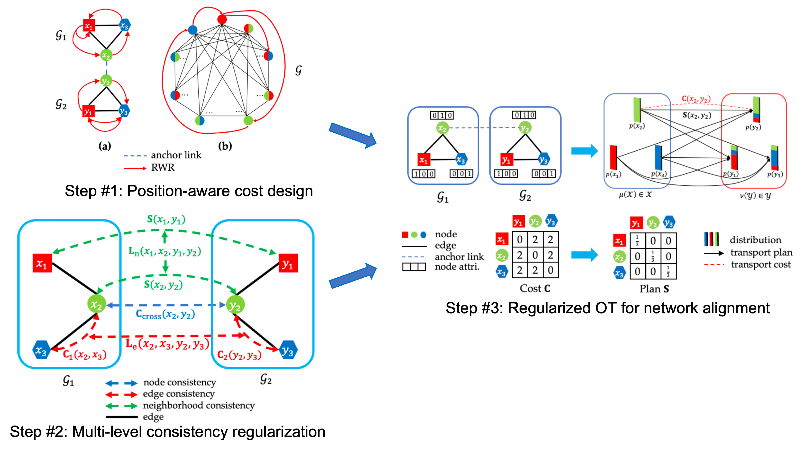

# PARROT: Position-Aware Regularized Optimal Transport for Network Alignment

## Overview
Implementation of [**"PARROT: Position-Aware Regularized Optimal Transport for Network Alignment"**](https://dl.acm.org/doi/abs/10.1145/3543507.3583357) in WWW23.
<p align="center">
  
</p>

- PARROT
    - cpot.m: constrained proximal point iteration for optimal transport in the log domain. Finding optimal solutions to regularized OT problems.
    - parrot.m: PARROT algorithm. Solving attributed/plain network alignment problem via position-aware regularized optimal transport.

- utils
    - cal_trans.m: calculate intra-graph transition matrix based on node similarity.
    - get_cost.m: calculate cross-network and intra-network cost based on rwr.
    - get_cross_cost.m: calculate cross-network cost.
    - get_hits.m: calculate Hits@K and MRR.
    - get_intra_cost.m: calculate intra-network cost.
    - get_prod_rwr.m: calculate rwr-level cross-network cost on the product graph.
    - get_sep_rwr.m: calculate rwr on separated graphs.

- datasets
    |dataset   |#nodes   |#edges   |#attri   |
    |---|---|---|---|
    |ACM(A)<br>DBLP(A)   |9,916<br>9,872   |44,808<br>39,561   |17   |
    |ACM(P)<br>DBLP(P)   |9,916<br>9,872   |44,808<br>39,561   |0   |
    |cora1<br>cora2   |2,708<br>2,708   |6,334<br>4,542   |1,433   |
    |foursquare<br>twitter   |5,313<br>5,210   |54,233<br>130,575   |0   |
    |phone<br>email   |1,000<br>1,003   |41,191<br>4,627   |0   |

- results
<p align="center">
  
</p>

## How to use
Directly run matlab files in the experiments folder to reproduce results in the paper.
For further use, a matfile is requried for each alignment task, including the following components:
- A1/A2: two adjacency matrices with shape [n1,n1], [n2,n2] for two networks.
- X1/X2: two node attribute matrices with shape [n1,d], [n2,d] for two networks. Use empty matrices for plain networks.
- H: anchor node set with shape [n2,n1] where H(i,j) indicates node j in G1 is aligned with node i in G2.
- gnd: ground-truth alignement with shape=[m,2] where the first column is the node index in G1 and the second column is the node index in G2.

## Reference
If you find our work useful for your research, please consider cite PARROT with the following bibtex:

```
@inproceedings{10.1145/3543507.3583357,
    author = {Zeng, Zhichen and Zhang, Si and Xia, Yinglong and Tong, Hanghang},
    title = {PARROT: Position-Aware Regularized Optimal Transport for Network Alignment},
    year = {2023},
    isbn = {9781450394161},
    publisher = {Association for Computing Machinery},
    address = {New York, NY, USA},
    url = {https://doi.org/10.1145/3543507.3583357},
    doi = {10.1145/3543507.3583357},
    booktitle = {Proceedings of the ACM Web Conference 2023},
    pages = {372–382},
    numpages = {11},
    keywords = {optimal transport, alignment consistency, network alignment},
    location = {Austin, TX, USA},
    series = {WWW '23}
}
```